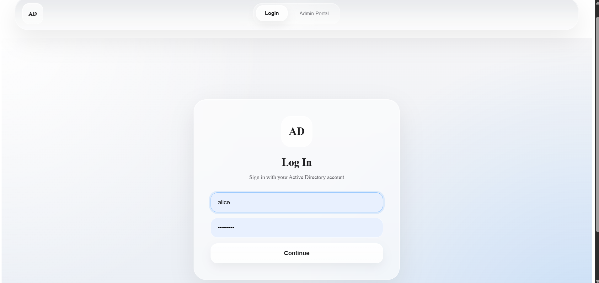
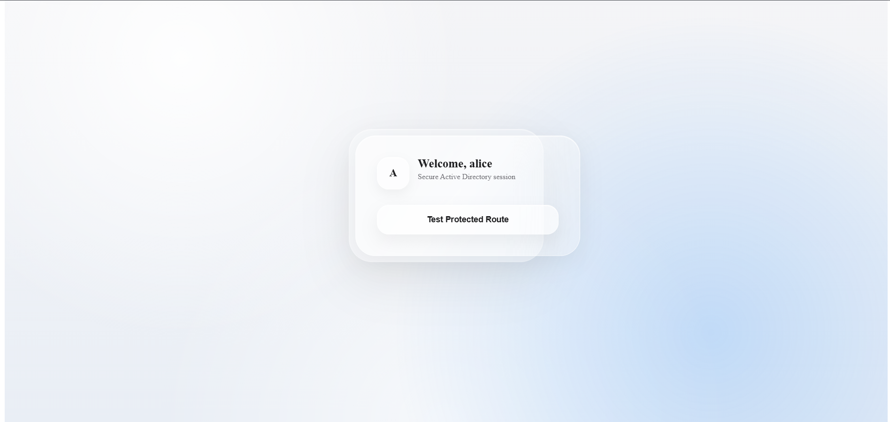
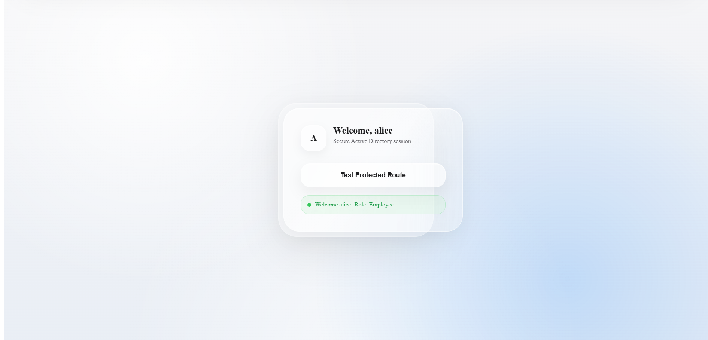
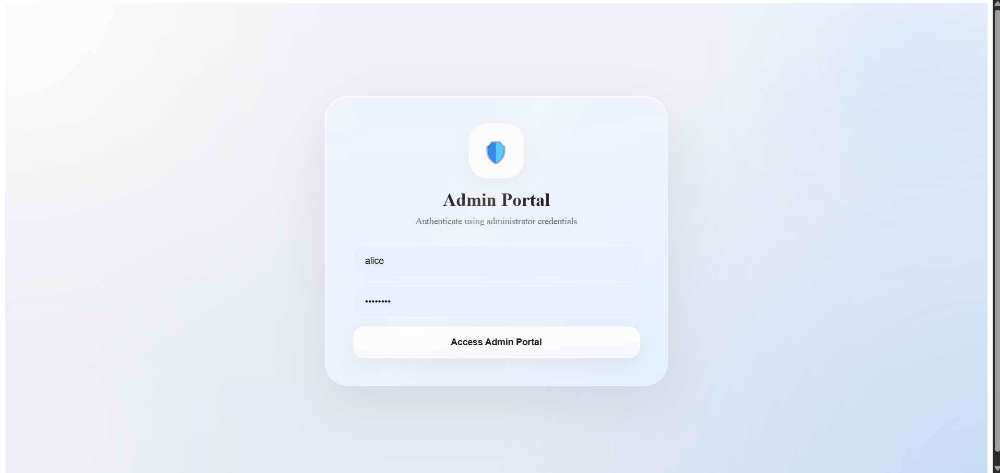
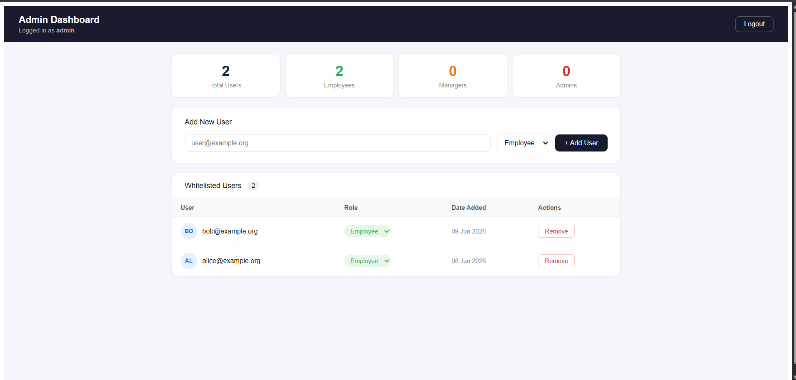
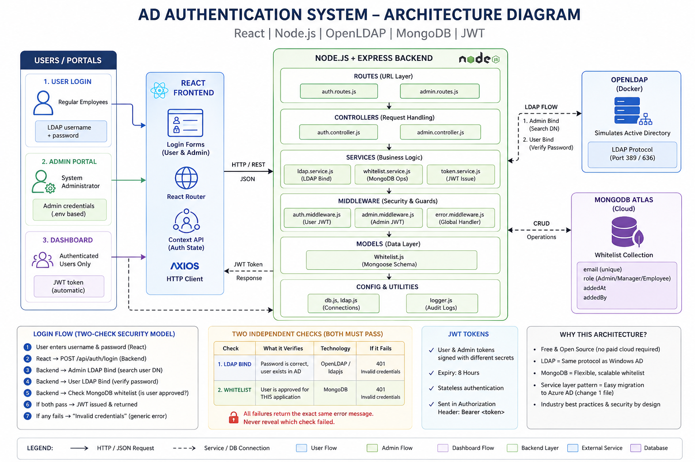

# AD Authentication & Authorization System

A full-stack authentication system built using **React, Node.js, OpenLDAP, MongoDB, and JWT**.

The application allows users to log in using Active Directory (LDAP) credentials while restricting access to only approved users through a MongoDB whitelist.

## Login Screen



## AD Secure Screen



## AD Role Screen



## Login Admin Screen



## Admin Pannel Screen




---

## Features

* LDAP-based authentication
* MongoDB whitelist authorization
* Role-based access control (Admin, Manager, Employee)
* Separate Admin Portal
* JWT authentication
* Protected routes
* User management (Add, Update, Remove users)

---

## Tech Stack

### Frontend

* React.js
* Axios
* Context API

### Backend

* Node.js
* Express.js
* JWT
* ldapjs

### Database

* MongoDB Atlas

### Directory Service

* OpenLDAP (Docker)

---

## Structure



## System Flow

```text
User Login
     │
     ▼
React Login Form
     │
     ▼
POST /api/auth/login
     │
     ▼
LDAP Authentication
(Check username & password)
     │
     ▼
MongoDB Whitelist Check
(Is user allowed?)
     │
     ▼
Generate JWT
     │
     ▼
Access Dashboard
```

---

## Security Design

Authentication succeeds only when:

1. User exists in Active Directory (LDAP)
2. User is present in the MongoDB whitelist

Both conditions must pass before a JWT token is issued.

---

## User Roles

| Role     | Access                          |
| -------- | ------------------------------- |
| Employee | Dashboard Access                |
| Manager  | Dashboard + Manager Permissions |
| Admin    | Full User Management            |

---

## Admin Portal

The Admin Portal allows administrators to:

* View whitelisted users
* Add users
* Remove users
* Update roles
* Manage application access

---

## Why MongoDB?

LDAP verifies **who the user is**.

MongoDB decides:

* Is the user allowed to access this application?
* What role does the user have?

This separation keeps authentication and authorization independent.

---

## Why i used OpenLDAP Instead of Azure AD?

OpenLDAP was used because:

* Free and open-source
* Implements the same LDAP protocol used by Active Directory
* Easy local development and testing
* No Azure subscription required

The architecture was designed so that migrating to Azure AD would require changing only the authentication service layer while keeping the rest of the application unchanged.

---

## API Endpoints

### Authentication

```http
POST /api/auth/login
GET  /api/dashboard
```

### Admin

```http
POST   /api/admin/whitelist/login
GET    /api/admin/whitelist
POST   /api/admin/whitelist
PATCH  /api/admin/whitelist/:email
DELETE /api/admin/whitelist/:email
```

---

## Future Enhancements

* Microsoft Azure AD Integration
* Audit Logs
* Department-based Access Control
* Multi-Factor Authentication (MFA)

---

## Key Takeaway

This project demonstrates a production-style authentication architecture where:

* LDAP handles authentication
* MongoDB handles authorization
* JWT manages sessions
* Admins control access through a dedicated management portal

The system is designed to be easily migrated from OpenLDAP to Microsoft Active Directory or Azure AD with minimal code changes.
